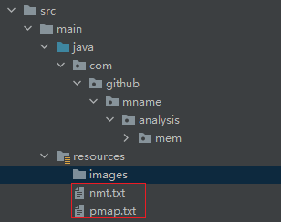
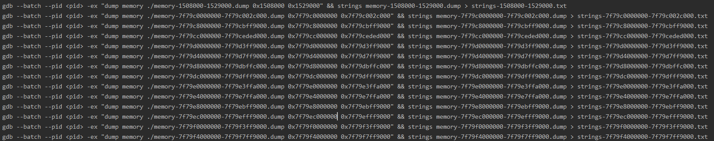
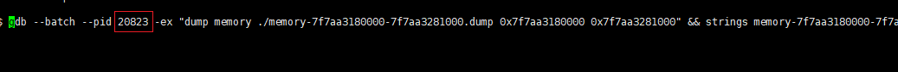

# 操作步骤
## 1.打印内存文件
```shell
pmap -X <pid> > pmap.txt
jcmd <pid> VM.native_memory detail > nmt.txt
```

## 2.将内存文件复制到项目的resources目录下


## 3.运行main方法，会分析出差异的内存块以及执行脚本


## 4.将生成的脚本的\<pid\>，改成对应程序的pid，然后执行

                                                                                                                                                                                                                                                                                                                                                                                                                                                                                  